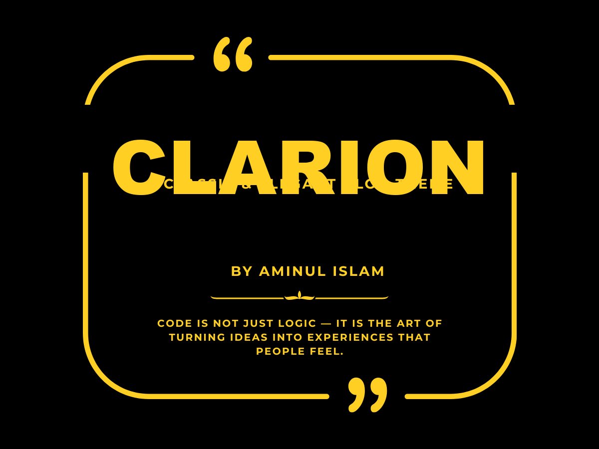

# Clarion — WordPress Blog Theme

**Clarion** is a classic and elegant WordPress blog theme built for writers and storytellers. It features beautiful serif typography, warm gold accents, a clean sidebar layout, and a timeless reading experience.

## Features

- Classic & elegant design with Playfair Display + Merriweather typography
- Responsive, mobile-first layout
- Customizer options: accent color, sidebar position, posts per row
- Right sidebar, left sidebar, or full-width layout
- Author bio box on single posts
- Related posts section (no plugins needed)
- Estimated reading time display
- Breadcrumb navigation (no plugins needed)
- Footer widget areas (3 columns)
- Social links menu
- Gutenberg block editor support with matching editor styles
- Dark mode support
- Full accessibility: skip links, ARIA roles, keyboard navigation, focus styles
- Translation ready (`.pot` file included)
- No jQuery — vanilla JS only

## Requirements

- WordPress 6.0 or higher
- PHP 7.4 or higher

## Installation

1. Download the latest release zip from the [Releases](../../releases) page.
2. In WordPress admin, go to **Appearance → Themes → Add New → Upload Theme**.
3. Upload the zip file and click **Activate**.

Or via FTP: upload the `clarion` folder to `/wp-content/themes/` and activate from the Themes screen.

## Customization

Go to **Appearance → Customize** to access:

- **Colors** — Accent color, background color
- **Layout** — Sidebar position (left / right / none), posts per row
- **Blog Options** — Show/hide author bio, reading time, post navigation
- **Footer** — Custom footer credit text

## Credits

- [normalize.css](https://github.com/necolas/normalize.css) by Nicolas Gallagher — MIT License
- [Playfair Display](https://fonts.google.com/specimen/Playfair+Display) by Claus Eggers Sørensen — SIL Open Font License 1.1
- [Merriweather](https://fonts.google.com/specimen/Merriweather) by Sorkin Type — SIL Open Font License 1.1

## License

GNU General Public License v2 or later — see [LICENSE](https://www.gnu.org/licenses/gpl-2.0.html)

---

**Author:** [Aminul Islam](https://aminuldeveloper.com)
